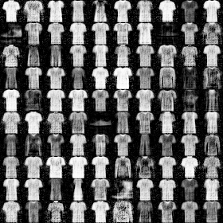
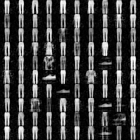
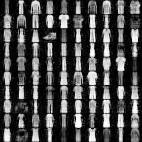
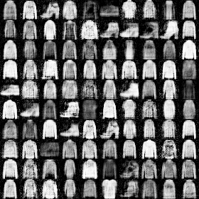
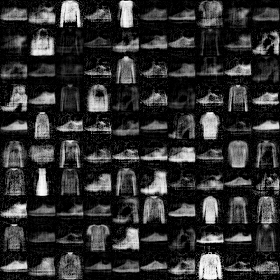
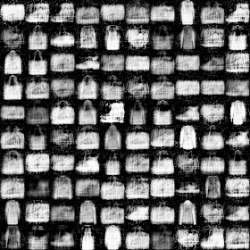

# Conditional-DRAGAN
Conditional DRAGAN(cGAN based) code(& model) repo.
This model is 4-layer-512-ReluMLP. not include any normalization.

Question is always welcome, Pls add some issue.

## conditional method
Its cGAN.
Concat Noise z and Label c(onehot), then linear layer(Fully-Coneccted Layer) handle it.

## Note
Sorry, training code is not available for now.
I'll add training code within days...

## Label
| Label | Description |
| --- | --- |
| 0 | T-shirt/top |
| 1 | Trouser |
| 2 | Pullover |
| 3 | Dress |
| 4 | Coat |
| 5 | Sandal |
| 6 | Shirt |
| 7 | Sneaker |
| 8 | Bag |
| 9 | Ankle boot |

## Generated Images
(model is gen_iter_18000.npz)
- T-Shirt/top

- Trouser

- pullover

- Dress

- Coat

- Sandal

- Shirt

- Sneaker

- Bag

- Ankle boot

# LICENSE
This materials provided as MIT License(Please see `LICENSE` file).
